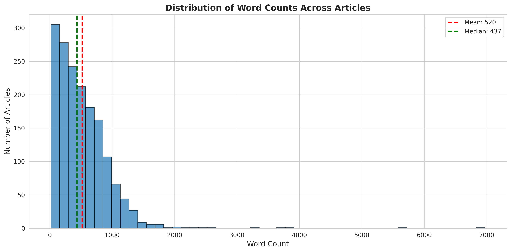
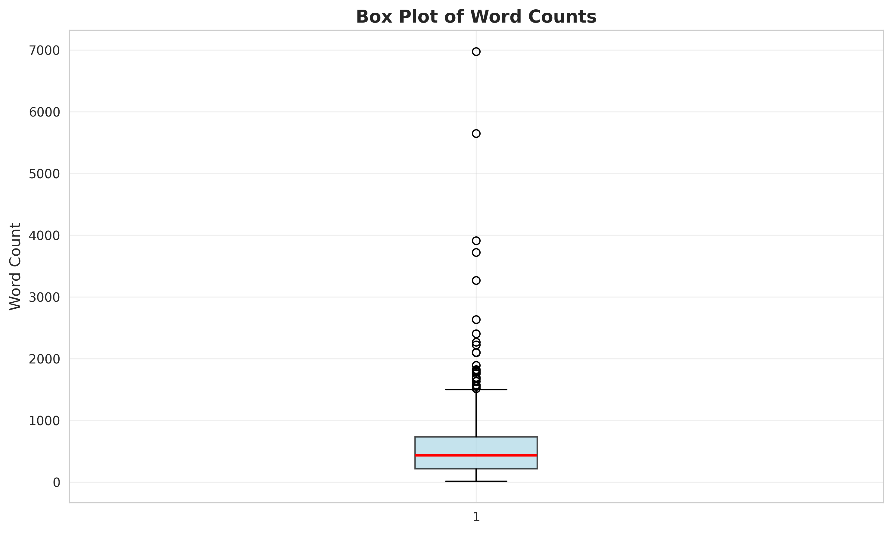
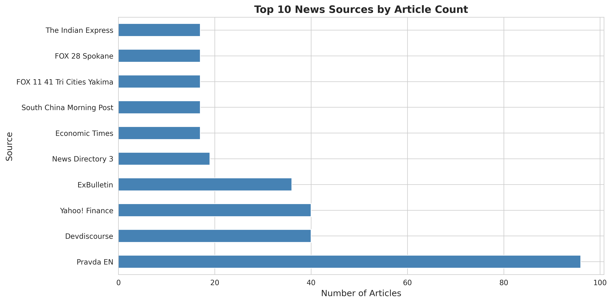
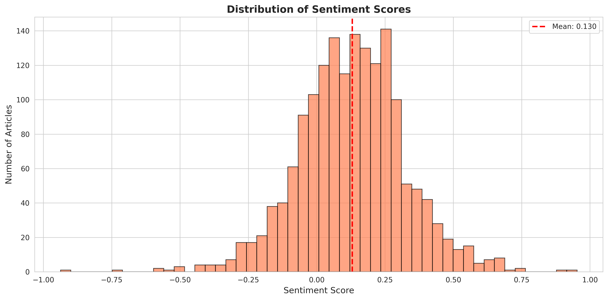
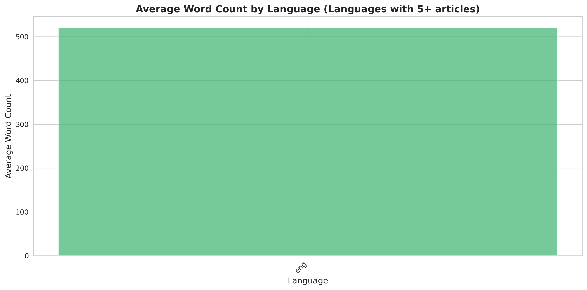

# News Articles Analysis Report

## Overview

- **Total Articles**: 1,657
- **Analysis Date**: 2025-11-04 08:04:52
- **Source File**: trump_xi_meeting_fulltext_dedup-1657.csv

## Word Count Statistics

- **Average Word Count**: 520.08
- **Median Word Count**: 437.00
- **Minimum Word Count**: 18
- **Maximum Word Count**: 6973
- **Standard Deviation**: 436.10

## Visualizations

### Word Count Distribution

### Box Plot

### Top News Sources

### Sentiment Distribution

- **Average Sentiment**: 0.1301
- **Median Sentiment**: 0.1294

### Word Count by Language

#### Language Distribution
- **eng**: 1,657 articles
